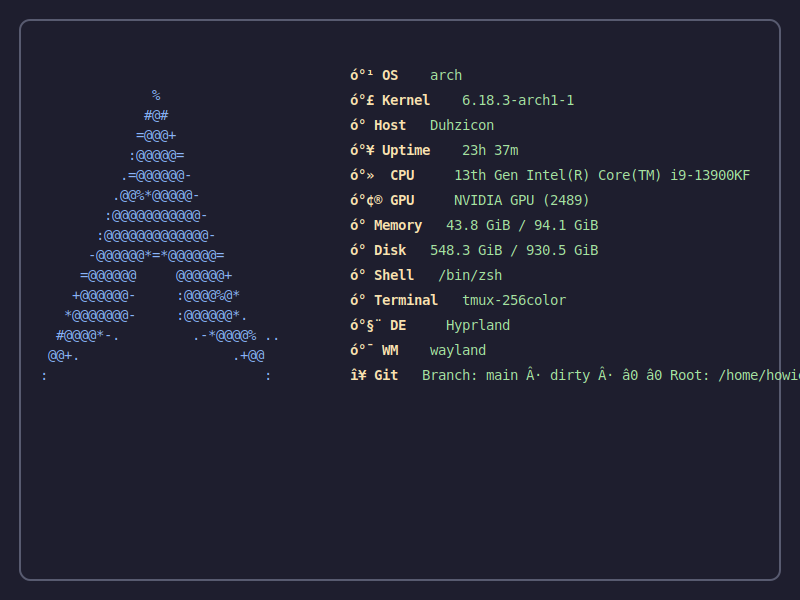

<p align="center">
  
</p>
<h1 align="center">bubblefetch</h1>
<p align="center">
  A fast, themeable system info tool built with Go and Bubbletea.<br>
  Single-run output (prints once, exits cleanly) — An alternative to neofetch/fastfetch.
</p>
<p align="center">
  <a href="https://github.com/howieduhzit/bubblefetch/releases/latest"></a>
  <a href="https://aur.archlinux.org/packages/bubblefetch-git"></a>
  <a href="LICENSE"></a>
  
  
</p>
<p align="center">
  <a href="https://howieduhzit.github.io/bubblefetch/">Landing page</a> ·
  <a href="docs/README.md">Docs</a> ·
  <a href="docs/QUICKSTART.md">Quickstart</a> ·
  <a href="#themes">Themes</a>
</p>
<p align="center">
  <a href="https://buymeacoffee.com/howieduhzit">Buy me a coffee</a>
</p>

## 🚀 One Command → Beautiful Output

```bash
# Default theme
bf
```

<p align="center">
  
</p>

```bash
# Switch themes instantly
bf --theme dracula

# Export as image
bf -o bubblefetch.svg

# Fetch Solana token data
bf --sol DezXAZ8z7PnrnRJjz3wXBoRgixCa6xjnB7YaB1pPB263
```

**Copy, paste, done.** No configuration needed to get gorgeous themed output.

---

## 📋 Table of Contents

- [Why Bubblefetch?](#why-bubblefetch)
- [What's New in v0.3.1](#-whats-new-in-v031)
- [Features](#features)
- [Installation](#installation)
- [Quick Start](#quick-start)
- [Common Setups](#common-setups)
- [Usage](#usage)
- [Themes](#themes)
- [Outputs](#outputs)
- [Privacy & Safety](#privacy--safety)
- [Troubleshooting](#troubleshooting)
- [Command-Line Reference](#command-line-reference)
- [Contributing](#contributing)
- [License](#license)

---

## Why Bubblefetch?

Bubblefetch brings modern features to the fetch tool space:

| Feature | Bubblefetch | fastfetch | neofetch |
|---------|-------------|-----------|----------|
| **Speed** | ~1.3ms median | ~10ms | ~130ms |
| **Plugin System** | ✅ Go plugins + external scripts | ❌ | ❌ |
| **Image Exports** | ✅ PNG, SVG, HTML | ❌ | ❌ |
| **Interactive Config** | ✅ TUI wizard | ❌ | ❌ |
| **SSH Remote Mode** | ✅ Full support | ⚠️ Limited | ❌ |
| **Domain Scan** | ✅ WHOIS + DNS | ❌ | ❌ |
| **Solana Token Info** | ✅ Real-time data | ❌ | ❌ |
| **Per-Module Timing** | ✅ `costs` module | ❌ | ❌ |
| **Export Formats** | JSON, YAML, text, PNG, SVG, HTML | JSON, text | ❌ |
| **Themes** | 8 built-in, easy custom | Custom | Custom |

**Performance methodology**: ~1.3ms median collection time on local system (excluding network calls) measured via `--benchmark` flag over 100 iterations.

---

## ✨ What's New in v0.3.1

### 🪙 Solana Token Info *(NEW!)*
Fetch and display Solana token data with real-time pricing and 24h charts.

```bash
bf --sol DezXAZ8z7PnrnRJjz3wXBoRgixCa6xjnB7YaB1pPB263
```

**[See example output →](docs/examples/solana-bonk.txt)**

<details>
<summary>Features from v0.3.0</summary>

### 🔌 Plugin System
Create custom modules with Go plugins or external scripts.

```bash
echo '{"label":"Weather","value":"72°F","icon":"󰖐"}' > plugin.sh
```

**[View plugin examples →](docs/PLUGINS.md#examples)**

### 🖼️ Image Export
Export as PNG, SVG, or HTML with full theme support.

```bash
bf -o bubblefetch.svg
```

**[View SVG example →](docs/examples/bubblefetch-default.svg)** · **[View PNG →](docs/examples/bubblefetch-default.png)**

### 🧙 Config Wizard
Interactive TUI setup with theme preview and module selection.

```bash
bf --config-wizard
```

**[See wizard screenshot →](#)** *(Manual: Take screenshot)*

### 🌐 Public IP Detection
Optional public IP display (privacy-first, disabled by default).

```bash
# Enable in config
enable_public_ip: true
modules:
  - publicip
```

</details>

See [docs/CHANGELOG.md](docs/CHANGELOG.md) for complete details.

---

## Features

### Core Features
- **⚡ Blazing Fast**: ~1.3ms median collection time - **100x faster than neofetch, 10x faster than fastfetch**
- **Styled Output**: Themed, framed terminal output with Nerd Font icons
- **OS Detection**: Automatically detects your OS/distro and displays appropriate ASCII art
- **Comprehensive Info**: CPU, GPU, memory, disk, network, battery, local IP, and more
- **Themeable**: 8 built-in themes with easy custom theme creation

### Advanced Features
- **🔌 Plugin System**: Extend with custom modules using Go plugins (.so files)
- **🧩 External Modules**: Drop executable scripts in `plugins/external/`
- **🧙 Interactive Config Wizard**: Guided setup with theme preview and module selection
- **🖼️ Image Export**: Export as PNG (raster), SVG (vector), or HTML (webpage)
- **🌐 Public IP Detection**: Optional public IP display (privacy-first, disabled by default)
- **🌍 SSH Remote Support**: Fetch system info from remote systems via SSH
- **🔎 Domain Scan**: WHOIS + DNS lookup via `--who`
- **🪙 Solana Token Info**: Fetch token data by contract address via `--sol`
- **📤 Export Modes**: Export to JSON, YAML, or plain text
- **📊 Benchmark Mode**: Measure collection performance (text or JSON output)
- **📈 Module Cost**: Visualize per-module timing with the `costs` module
- **⚙️ Highly Customizable**: YAML config, custom themes, modular system info display

---

## Documentation

- Start here: [docs/README.md](docs/README.md)
- Quick setup: [docs/QUICKSTART.md](docs/QUICKSTART.md)
- Examples: [docs/EXAMPLES.md](docs/EXAMPLES.md)
- Plugins: [docs/PLUGINS.md](docs/PLUGINS.md)
- Exports schema: [docs/EXPORTS.md](docs/EXPORTS.md)
- Remote mode: [docs/REMOTE.md](docs/REMOTE.md)
- Performance: [docs/PERFORMANCE.md](docs/PERFORMANCE.md)

---

## Installation

### Release Binaries

- https://github.com/howieduhzit/bubblefetch/releases/latest

### Arch Linux (AUR)

```bash
yay -S bubblefetch-git
```

AUR package: https://aur.archlinux.org/packages/bubblefetch-git
Installs the `bf` alias alongside `bubblefetch`.

### Quick Install (recommended)

```bash
git clone https://github.com/howieduhzit/bubblefetch.git
cd bubblefetch
./install.sh
```

This script:
- Builds the optimized binary
- Installs to `/usr/local/bin`
- Creates `~/.config/bubblefetch`
- Copies themes + example config

<details>
<summary>Manual install</summary>

```bash
git clone https://github.com/howieduhzit/bubblefetch.git
cd bubblefetch
go build -ldflags="-s -w" -o bubblefetch ./cmd/bubblefetch
sudo mv bubblefetch /usr/local/bin/
```
</details>

<details>
<summary>Go install</summary>

```bash
go install github.com/howieduhzit/bubblefetch/cmd/bubblefetch@latest
```
</details>

---

## Quick Start

New to bubblefetch? Get started in 60 seconds:

```bash
# 1. Install bubblefetch
git clone https://github.com/howieduhzit/bubblefetch.git
cd bubblefetch
./install.sh

# 2. Run the interactive setup wizard
bubblefetch --config-wizard

# 3. Run bubblefetch!
bf

# 4. Try different themes
bf --theme dracula
bf --theme nord

# 5. Export your setup
bf -o my-setup.png
```

That's it! See [docs/QUICKSTART.md](docs/QUICKSTART.md) for more detailed guidance.

---

## Common Setups

Ready-to-run recipes for popular use cases:

### 🪶 Minimal Laptop
Clean output, fast, low overhead.

```bash
# config.yaml
theme: minimal
modules:
  - os
  - kernel
  - uptime
  - cpu
  - memory
  - battery
```

```bash
bf
```

---

### 🎥 Streamer Flex
Full specs, colorful theme, export-ready.

```bash
# config.yaml
theme: dracula
modules:
  - os
  - kernel
  - host
  - cpu
  - gpu
  - memory
  - disk
  - network
  - localip
```

```bash
bf -o ~/stream-assets/sysinfo.png
```

---

### 🔒 Remote Server Audit (Safe Mode)
No shell pipelines, read-only commands.

```bash
bf --remote production-server --remote-safe --export json > audit.json
```

---

### 🎨 Theme Author Starter
Test themes quickly, enable timing.

```bash
# config.yaml
modules:
  - os
  - kernel
  - cpu
  - memory
  - costs  # Shows per-module timing
```

```bash
bf --theme my-custom-theme
```

---

## Usage

### Basic Usage

```bash
# Run with default settings
bubblefetch

# Short alias
bf

# Use a specific theme
bubblefetch --theme dracula

# Use custom config file
bubblefetch --config ~/.config/bubblefetch/custom.yaml
```

**Tip**: Use a Nerd Font in your terminal to see module icons.
**Note**: bubblefetch prints once and exits (no interactive TUI).

---

### Remote Systems (SSH)

```bash
# Fetch info from remote system via SSH
bubblefetch --remote user@hostname

# Uses your SSH config and keys automatically
bubblefetch --remote myserver

# Read-only safe mode (no shell pipelines)
bubblefetch --remote myserver --remote-safe
```

---

### Domain Scan

```bash
bf --who google.com
bf --who google.com -R  # Include raw WHOIS
```

---

### Solana Token Info

```bash
# Fetch token data by contract address
bf --sol EPjFWdd5AufqSSqeM2qN1xzybapC8G4wEGGkZwyTDt1v

# Short form
bf -s EPjFWdd5AufqSSqeM2qN1xzybapC8G4wEGGkZwyTDt1v

# With theme
bf --sol EPjFWdd5AufqSSqeM2qN1xzybapC8G4wEGGkZwyTDt1v --theme dracula

# Export as JSON
bf --sol EPjFWdd5AufqSSqeM2qN1xzybapC8G4wEGGkZwyTDt1v --export json
```

#### 🚀 Enhanced Token Data with Bags.fm

For tokens launched via [Bags.fm](https://bags.fm), get additional data including:
- **Creator Info**: Who deployed the token (username + platform)
- **Launch Date**: When the token was created
- **Total Fees**: Lifetime fees collected by the token

<details>
<summary><strong>Setup (Optional)</strong></summary>

1. Get your free API key at [dev.bags.fm](https://dev.bags.fm)
2. Add to your config:

```yaml
# ~/.config/bubblefetch/config.yaml
bags_api_key: "your-api-key-here"
```

**Note**: Bags.fm data only appears for tokens launched through their platform. All other tokens still work with DexScreener data.

</details>

---

### Export Modes

```bash
# Export as JSON
bubblefetch --export json > system.json

# Export as YAML
bubblefetch --export yaml > system.yaml

# Export as plain text
bubblefetch --export text > system.txt

# Compact JSON (no pretty print)
bubblefetch --export json --pretty=false
```

---

### Benchmark Mode

```bash
# Run 10 iterations and show performance stats
bubblefetch --benchmark

# JSON benchmark output
bubblefetch --benchmark --format json
```

---

### Interactive Config Wizard

First time setup? Run the interactive wizard:

```bash
bubblefetch --config-wizard
```

The wizard will guide you through:
- Theme selection (preview all 8 built-in themes)
- Module selection (choose which info to display)
- Privacy settings (enable/disable public IP detection)
- Plugin directory configuration

Configuration is saved to `~/.config/bubblefetch/config.yaml`

---

### Plugin System

Create custom modules with either external scripts or Go plugins.

**External modules (recommended):**

```bash
mkdir -p ~/.config/bubblefetch/plugins/external
cat > ~/.config/bubblefetch/plugins/external/weather.sh <<'EOF'
#!/usr/bin/env bash
echo '{"label":"Weather","value":"72°F","icon":"󰖐"}'
EOF
chmod +x ~/.config/bubblefetch/plugins/external/weather.sh
```

Add `weather` to your `modules` list.

**Git context example** (branch, dirty, ahead/behind, root):

```bash
mkdir -p ~/.config/bubblefetch/plugins/external
cp plugins/examples/external/git-context.sh ~/.config/bubblefetch/plugins/external/
chmod +x ~/.config/bubblefetch/plugins/external/git-context.sh
```

**Go plugins (power users):**

```bash
# Build example plugin
make plugin-hello

# Install to plugin directory
make install-plugins

# Add to config
modules:
  - hello  # Your custom plugin
  - os
  - cpu
```

**Plugin Development:**
- See `docs/PLUGINS.md` for complete guide
- Examples in `plugins/examples/`
- Platform support: Linux, macOS, FreeBSD (not Windows)

Quick example:
```go
package main

import (
    "github.com/howieduhzit/bubblefetch/internal/collectors"
    "github.com/howieduhzit/bubblefetch/internal/ui/theme"
)

var ModuleName = "hello"

func Render(info *collectors.SystemInfo, styles theme.Styles) string {
    return styles.Label.Render("Hello") +
           styles.Separator.Render(": ") +
           styles.Value.Render("World!")
}
```

---

## Themes

Bubblefetch includes 8 beautiful built-in themes. Switch instantly with `--theme`:

### Default (Catppuccin Mocha)
```bash
bf --theme default
```
<details>
<summary>Preview</summary>

*(Manual: Add screenshot)*

**Colors**: Primary #89b4fa, Secondary #cba6f7, Accent #f38ba8
**Border**: Rounded
**[Download theme file →](themes/default.json)**
</details>

---

### Dracula
```bash
bf --theme dracula
```
<details>
<summary>Preview</summary>

*(Manual: Add screenshot)*

**Colors**: Primary #bd93f9, Secondary #ff79c6, Accent #50fa7b
**Border**: Double
**[Download theme file →](themes/dracula.json)**
</details>

---

### Nord
```bash
bf --theme nord
```
<details>
<summary>Preview</summary>

*(Manual: Add screenshot)*

**Colors**: Primary #88c0d0, Secondary #81a1c1, Accent #b48ead
**Border**: Thick
**[Download theme file →](themes/nord.json)**
</details>

---

### Gruvbox
```bash
bf --theme gruvbox
```
<details>
<summary>Preview</summary>

*(Manual: Add screenshot)*

**Colors**: Primary #fabd2f, Secondary #fe8019, Accent #b8bb26
**Border**: Rounded
**[Download theme file →](themes/gruvbox.json)**
</details>

---

### Tokyo Night
```bash
bf --theme tokyo-night
```
<details>
<summary>Preview</summary>

*(Manual: Add screenshot)*

**Colors**: Primary #7aa2f7, Secondary #bb9af7, Accent #9ece6a
**Border**: Rounded
**[Download theme file →](themes/tokyo-night.json)**
</details>

---

### Solarized Dark
```bash
bf --theme solarized-dark
```
<details>
<summary>Preview</summary>

*(Manual: Add screenshot)*

**Colors**: Primary #268bd2, Secondary #6c71c4, Accent #859900
**Border**: Normal
**[Download theme file →](themes/solarized-dark.json)**
</details>

---

### Monokai
```bash
bf --theme monokai
```
<details>
<summary>Preview</summary>

*(Manual: Add screenshot)*

**Colors**: Primary #66d9ef, Secondary #f92672, Accent #a6e22e
**Border**: Normal
**[Download theme file →](themes/monokai.json)**
</details>

---

### Minimal
```bash
bf --theme minimal
```
<details>
<summary>Preview</summary>

*(Manual: Add screenshot)*

**Colors**: Monochrome white/gray
**Border**: None
**[Download theme file →](themes/minimal.json)**
</details>

---

### Creating Custom Themes

Copy a theme file to `~/.config/bubblefetch/themes/mytheme.json`:

```json
{
  "name": "mytheme",
  "colors": {
    "primary": "#89b4fa",
    "secondary": "#cba6f7",
    "accent": "#f38ba8",
    "label": "#f9e2af",
    "value": "#a6e3a1",
    "border": "#585b70",
    "background": "#1e1e2e"
  },
  "ascii": "auto",
  "layout": {
    "show_ascii": true,
    "ascii_width": 30,
    "separator": " ",
    "padding": 2,
    "border_style": "rounded"
  }
}
```

Then use it:
```bash
bf --theme mytheme
```

**Share your themes!** Submit a PR to `themes/` directory.

---

## Outputs

Bubblefetch can export your system info in multiple formats:

### Image Exports

Perfect for sharing your setup on social media, creating wallpapers, or documentation.

#### PNG Export (Raster)
```bash
bf --image-export png --image-output sysinfo.png
```

<details>
<summary>Preview PNG example</summary>


**[View full size →](docs/examples/bubblefetch-default.png)**
</details>

---

#### SVG Export (Vector)
```bash
bf --image-export svg --image-output sysinfo.svg
```

<details>
<summary>Preview SVG example</summary>



**[View full size →](docs/examples/bubblefetch-default.svg)**
</details>

---

#### HTML Export (Webpage)
```bash
bf --image-export html --image-output sysinfo.html
```

<details>
<summary>Preview HTML example</summary>

Standalone, responsive webpage with embedded CSS.

**[View HTML file →](docs/examples/bubblefetch-default.html)**
</details>

---

### Data Exports

Export system info as structured data for scripting or monitoring:

```bash
# JSON (pretty)
bf --export json

# JSON (compact)
bf --export json --pretty=false

# YAML
bf --export yaml

# Plain text
bf --export text
```

All exports respect your configured modules and collect the same data as visual output.

---

## Privacy & Safety

### What Bubblefetch Collects

**Local only** (default):
- OS/distro, kernel version
- Hostname
- CPU, GPU, memory, disk usage
- Active network interfaces
- Battery status (if applicable)
- Current shell, terminal emulator

**Optional network features** (disabled by default):
- Public IP detection (`enable_public_ip: true`)
  - Tries api.ipify.org, icanhazip.com, ifconfig.me
  - 2-second timeout
  - Completely optional
- WHOIS/DNS lookup (`--who domain.com`)
- Solana token data (`--sol address`)
- SSH remote collection (`--remote user@host`)

### Default Behavior

- **No network calls** by default
- **No telemetry** or analytics
- **No data sent** to external servers
- All data stays on your machine

### Disabling Network Features

```yaml
# config.yaml
enable_public_ip: false  # Default

# Don't add these modules
modules:
  # - publicip  # Leave this commented
```

Or use `--remote-safe` for SSH mode to disable shell pipelines.

### SSH Remote Mode Safety

When using `--remote`:
- Uses your existing SSH config
- Respects SSH key auth
- Safe mode (`--remote-safe`) disables shell pipelines
- Only collects system info (no destructive operations)

**Recommendation**: Always use `--remote-safe` on production systems.

---

## Troubleshooting

### Nerd Font Icons Not Showing

**Problem**: Module icons appear as boxes or question marks.

**Solution**: Install a Nerd Font and configure your terminal to use it.

```bash
# 1. Install a Nerd Font (example: JetBrains Mono)
# Download from https://www.nerdfonts.com/

# 2. Configure terminal to use the font
# - Most terminals: Settings → Font → Select "JetBrains Mono Nerd Font"
# - Alacritty: Update ~/.config/alacritty/alacritty.yml
# - Kitty: Update ~/.config/kitty/kitty.conf

# 3. Test
bf
```

**Recommended fonts**: JetBrains Mono Nerd Font, FiraCode Nerd Font, Hack Nerd Font

---

### macOS/Windows Support

**Status**:
- **Linux**: ✅ Fully supported
- **macOS**: ⚠️ Core features work, plugins limited (no `.so` support)
- **FreeBSD**: ✅ Supported
- **Windows**: ❌ Not supported (PRs welcome!)

**macOS limitations**:
- Go plugins (`.so` files) don't work
- External script plugins work fine
- All other features supported

---

### SSH Remote Prerequisites

**Problem**: `--remote` fails to connect.

**Check**:
1. Can you SSH manually?
   ```bash
   ssh user@hostname
   ```

2. Is your SSH key added?
   ```bash
   ssh-add -l
   ```

3. Is the remote host in `~/.ssh/known_hosts`?

4. Use `--remote-safe` if you see permission errors.

**Still stuck?** [Open an issue](https://github.com/howieduhzit/bubblefetch/issues) with your error message.

---

### Plugin Not Loading

**Problem**: Custom plugin doesn't appear in output.

**Checklist**:
1. Is the plugin in the correct directory?
   ```bash
   ls ~/.config/bubblefetch/plugins/external/
   ```

2. Is it executable?
   ```bash
   chmod +x ~/.config/bubblefetch/plugins/external/myplugin.sh
   ```

3. Does it output valid JSON?
   ```bash
   ~/.config/bubblefetch/plugins/external/myplugin.sh
   # Should output: {"label":"...","value":"..."}
   ```

4. Is it in your modules list?
   ```yaml
   # config.yaml
   modules:
     - myplugin  # Must match filename (without extension)
   ```

See [docs/PLUGINS.md](docs/PLUGINS.md) for complete guide.

---

### Performance Issues

**Problem**: Bubblefetch seems slow.

**Debug**:
```bash
# Check per-module timing
bf  # Add "costs" to your modules list

# Run benchmark
bf --benchmark

# Expected: ~1-2ms on modern hardware
```

**Common causes**:
- Network-dependent modules (publicip, plugins that fetch data)
- Slow SSH connection (use `--remote-safe`)
- Many external plugins with timeouts

**Solution**: Disable slow modules or increase plugin timeout in config.

---

## Modules

Available built-in modules:

- `os` - Operating system name
- `kernel` - Kernel version
- `host` - Hostname
- `uptime` - System uptime
- `cpu` - CPU model
- `gpu` - GPU model
- `memory` - RAM usage
- `disk` - Disk usage
- `shell` - Current shell
- `terminal` - Terminal emulator
- `network` - Active network interfaces
- `localip` - Local IP address
- `publicip` - Public IP address (optional)
- `battery` - Battery status (laptops)
- `costs` - Per-module timing

Add custom modules via [plugins](#plugin-system)!

### Configuration

```yaml
# ~/.config/bubblefetch/config.yaml
theme: default
modules:
  - os
  - kernel
  - cpu
  - memory
  - disk
  - uptime
```

---

## Command-Line Reference

```
Usage: bubblefetch [OPTIONS]

Options:
  -c, --config string         Path to config file (default: ~/.config/bubblefetch/config.yaml)
  -t, --theme string          Theme name to use (overrides config)
  -r, --remote string         Remote system IP/hostname to fetch info from (via SSH)
  -e, --export string         Export format: json, yaml, or text
  -p, --pretty                Pretty print JSON output (default: true)
  -b, --benchmark             Run benchmark mode (10 iterations)
  -f, --format string         Benchmark output format: text or json
  -w, --config-wizard         Run interactive configuration wizard
  --image-export string       Export as image: png, svg, or html
  -o, --image-output string   Image output path (default: bubblefetch.{format})
  -W, --who string            Domain scan (WHOIS + DNS records)
  -R, --who-raw               Include raw WHOIS output
  -s, --sol string            Fetch Solana token data by contract address
  --remote-safe               Use read-only SSH commands (no shell pipelines)
  -v, --version               Print version information
  -h, --help                  Show help message

Notes:
  - If --image-export is omitted, the format is inferred from --image-output extension.
  - Add "costs" to your modules list to display per-module timing.

Examples:
  bubblefetch                                    # Run with default config
  bf                                             # Short alias
  bubblefetch --theme dracula                    # Use dracula theme
  bf -t dracula                                  # Short flags
  bubblefetch --config-wizard                    # Interactive setup
  bubblefetch --remote user@server               # SSH to remote system
  bf -r user@server                              # Short remote flag
  bubblefetch --export json --pretty=false       # Export compact JSON
  bf -e json -p=false                            # Short export flags
  bubblefetch --image-export png                 # Export as PNG
  bf -o ~/Pictures/fetch.svg                     # Auto-detect SVG from extension
  bubblefetch --who google.com                   # Domain WHOIS + DNS scan
  bubblefetch --sol <contract_address>           # Solana token info
  bf -s EPjFWdd...                               # Short Solana flag
  bubblefetch --benchmark                        # Performance test
```

---

## Contributing

Contributions welcome! We're especially looking for:

- **Theme contributions**: Share your custom themes
- **Plugin examples**: Show off creative plugins
- **Documentation improvements**: Help others get started
- **Bug reports**: [Open an issue](https://github.com/howieduhzit/bubblefetch/issues)
- **Feature requests**: Tell us what you'd like to see

See [CONTRIBUTING.md](CONTRIBUTING.md) for guidelines.

---

## License

MIT License - see [LICENSE](LICENSE) for details.

---

## Acknowledgments

- Built with [Bubbletea](https://github.com/charmbracelet/bubbletea) and [Lipgloss](https://github.com/charmbracelet/lipgloss)
- Inspired by [neofetch](https://github.com/dylanaraps/neofetch) and [fastfetch](https://github.com/fastfetch-cli/fastfetch)
- ASCII art detection from [DistroWatch](https://distrowatch.com/)

---

<p align="center">Made with ❤️ by the Bubblefetch community</p>
<p align="center">
  <a href="https://github.com/howieduhzit/bubblefetch/stargazers">⭐ Star us on GitHub!</a>
</p>
