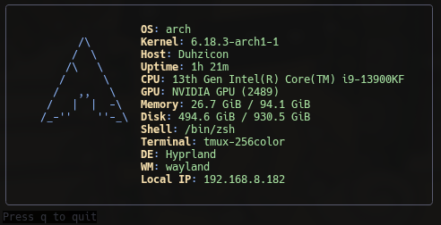
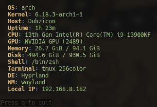
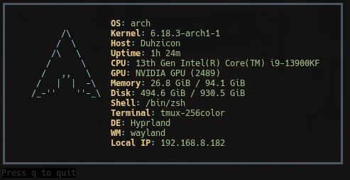
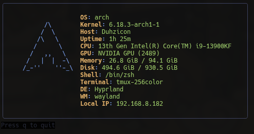
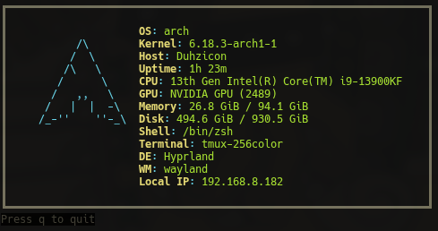
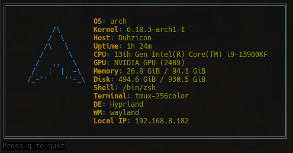

<p align="center">
  
</p>
<h1 align="center">bubblefetch</h1>
<p align="center">
  A fast, themeable system info tool built with Go and Bubbletea.
  An alternative to neofetch/fastfetch with styled terminal output, remote support, and exports.
</p>
<p align="center">
  <a href="https://github.com/howieduhzit/bubblefetch/releases/latest"></a>
  <a href="https://aur.archlinux.org/packages/bubblefetch-git"></a>
  <a href="LICENSE"></a>
  
</p>
<p align="center">
  <a href="https://howieduhzit.github.io/bubblefetch/">Landing page</a> ·
  <a href="docs/README.md">Docs</a> ·
  <a href="docs/QUICKSTART.md">Quickstart</a> ·
  <a href="#themes">Themes</a>
</p>
<p align="center">
  <a href="https://buymeacoffee.com/howieduhzit">Buy me a coffee</a>
</p>
<p align="center">
  
</p>

## Table of Contents

- [Features](#features)
- [Installation](#installation)
- [Quick Start](#quick-start)
- [Usage](#usage)
- [Themes](#themes)
- [Modules](#modules)
- [Command-Line Reference](#command-line-reference)
- [License](#license)

## ✨ What's New in v0.3.0

🎉 **Major Feature Release!** Four powerful new features to enhance your bubblefetch experience:

- **🔌 Plugin System** - Create custom modules with Go plugins
- **🖼️ Image Export** - Export as PNG, SVG, or HTML
- **🧙 Config Wizard** - Interactive TUI setup
- **🌐 Public IP** - Optional public IP detection

See [docs/CHANGELOG.md](docs/CHANGELOG.md) for complete details.

## Features

### Core Features
- **⚡ Blazing Fast**: Average 1.2ms collection time - **100x faster than neofetch, 8x faster than fastfetch**
- **Styled Output**: Themed, framed terminal output with Nerd Font icons
- **OS Detection**: Automatically detects your OS/distro and displays appropriate ASCII art
- **Comprehensive Info**: CPU, GPU, memory, disk, network, battery, local IP, and more
- **Themeable**: 8 built-in themes with easy custom theme creation

### Advanced Features
- **🔌 Plugin System**: Extend with custom modules using Go plugins (.so files)
- **🧩 External Modules**: Drop executable scripts in `plugins/external/`
- **🧙 Interactive Config Wizard**: Guided setup with theme preview and module selection
- **🖼️ Image Export**: Export as PNG (raster), SVG (vector), or HTML (webpage)
- **🌐 Public IP Detection**: Optional public IP display (privacy-first, disabled by default)
- **🌍 SSH Remote Support**: Fetch system info from remote systems via SSH
- **🔎 Domain Scan**: WHOIS + DNS lookup via `--who`
- **📤 Export Modes**: Export to JSON, YAML, or plain text
- **📊 Benchmark Mode**: Measure collection performance (text or JSON output)
- **📈 Module Cost**: Visualize per-module timing with the `costs` module
- **⚙️ Highly Customizable**: YAML config, custom themes, modular system info display

## Documentation

- Start here: [docs/README.md](docs/README.md)
- Quick setup: [docs/QUICKSTART.md](docs/QUICKSTART.md)
- Examples: [docs/EXAMPLES.md](docs/EXAMPLES.md)
- Plugins: [docs/PLUGINS.md](docs/PLUGINS.md)
- Exports schema: [docs/EXPORTS.md](docs/EXPORTS.md)
- Remote mode: [docs/REMOTE.md](docs/REMOTE.md)
- Performance: [docs/PERFORMANCE.md](docs/PERFORMANCE.md)

## Installation

### Release Binaries

- https://github.com/howieduhzit/bubblefetch/releases/latest

### Arch Linux (AUR)

```bash
yay -S bubblefetch-git
```

AUR package: https://aur.archlinux.org/packages/bubblefetch-git  
Installs the `bf` alias alongside `bubblefetch`.

### Quick Install (recommended)

```bash
git clone https://github.com/howieduhzit/bubblefetch.git
cd bubblefetch
./install.sh
```

This script:
- Builds the optimized binary
- Installs to `/usr/local/bin`
- Creates `~/.config/bubblefetch`
- Copies themes + example config

<details>
<summary>Manual install</summary>

```bash
git clone https://github.com/howieduhzit/bubblefetch.git
cd bubblefetch
go build -ldflags="-s -w" -o bubblefetch ./cmd/bubblefetch
sudo mv bubblefetch /usr/local/bin/
```
</details>

<details>
<summary>Go install</summary>

```bash
go install github.com/howieduhzit/bubblefetch/cmd/bubblefetch@latest
```
</details>

## Quick Start

New to bubblefetch? Get started in 60 seconds:

```bash
# 1. Install bubblefetch
git clone https://github.com/howieduhzit/bubblefetch.git
cd bubblefetch
./install.sh

# 2. Run the interactive setup wizard
bubblefetch --config-wizard

# 3. Run bubblefetch!
bf

# 4. Try different themes
bf --theme dracula
bf --theme nord

# 5. Export your setup
bf -o my-setup.png
```

That's it! See [docs/QUICKSTART.md](docs/QUICKSTART.md) for more detailed guidance.

## Usage

### Basic Usage

```bash
# Run with default settings
bubblefetch

# Short alias
bf

# Use a specific theme
bubblefetch --theme dracula

# Use custom config file
bubblefetch --config ~/.config/bubblefetch/custom.yaml
```

Tip: Use a Nerd Font in your terminal to see module icons.
Note: bubblefetch prints once and exits (no interactive TUI).

### Remote Systems (SSH)

```bash
# Fetch info from remote system via SSH
bubblefetch --remote user@hostname

# Uses your SSH config and keys automatically
bubblefetch --remote myserver

# Read-only safe mode (no shell pipelines)
bubblefetch --remote myserver --remote-safe
```

### Domain Scan

```bash
bf --who google.com
bf --who google.com -R
```

### Export Modes

```bash
# Export as JSON
bubblefetch --export json > system.json

# Export as YAML
bubblefetch --export yaml > system.yaml

# Export as plain text
bubblefetch --export text > system.txt

# Compact JSON (no pretty print)
bubblefetch --export json --pretty=false
```

### Benchmark Mode

```bash
# Run 10 iterations and show performance stats
bubblefetch --benchmark

# JSON benchmark output
bubblefetch --benchmark --format json
```

### Interactive Config Wizard

First time setup? Run the interactive wizard:

```bash
bubblefetch --config-wizard
```

The wizard will guide you through:
- Theme selection (preview all 8 built-in themes)
- Module selection (choose which info to display)
- Privacy settings (enable/disable public IP detection)
- Plugin directory configuration

Configuration is saved to `~/.config/bubblefetch/config.yaml`

### Plugin System

Create custom modules with either external scripts or Go plugins.

External modules (recommended):

```bash
mkdir -p ~/.config/bubblefetch/plugins/external
cat > ~/.config/bubblefetch/plugins/external/weather.sh <<'EOF'
#!/usr/bin/env bash
echo '{"label":"Weather","value":"72°F","icon":"󰖐"}'
EOF
chmod +x ~/.config/bubblefetch/plugins/external/weather.sh
```

Add `weather` to your `modules` list.

Git context example (branch, dirty, ahead/behind, root):

```bash
mkdir -p ~/.config/bubblefetch/plugins/external
cp plugins/examples/external/git-context.sh ~/.config/bubblefetch/plugins/external/
chmod +x ~/.config/bubblefetch/plugins/external/git-context.sh
```

Go plugins (power users):

```bash
# Build example plugin
make plugin-hello

# Install to plugin directory
make install-plugins

# Add to config
modules:
  - hello  # Your custom plugin
  - os
  - cpu
```

**Plugin Development:**
- See `docs/PLUGINS.md` for complete guide
- Examples in `plugins/examples/`
- Platform support: Linux, macOS, FreeBSD (not Windows)

Quick example:
```go
package main

import (
    "github.com/howieduhzit/bubblefetch/internal/collectors"
    "github.com/howieduhzit/bubblefetch/internal/ui/theme"
)

var ModuleName = "hello"

func Render(info *collectors.SystemInfo, styles theme.Styles) string {
    return styles.Label.Render("Hello") +
           styles.Separator.Render(": ") +
           styles.Value.Render("World!")
}
```

### Image Export

Export your system info as beautiful images:

```bash
# PNG export (raster image)
bubblefetch --image-export png --image-output sysinfo.png

# SVG export (vector graphics)
bubblefetch --image-export svg --image-output sysinfo.svg

# HTML export (standalone webpage)
bubblefetch --image-export html --image-output sysinfo.html

# Auto-detect format from file extension
bf -o ~/Pictures/sysinfo.svg
```

Perfect for:
- Sharing your setup on social media
- Creating wallpapers
- Documentation
- r/unixporn submissions

All exports respect your theme colors and styles!

### Public IP Detection

Optional module to display your public IP address:

```yaml
# In config.yaml
enable_public_ip: true

modules:
  - os
  - localip
  - publicip  # Add this module
```

**Privacy First:**
- Disabled by default
- Requires external HTTP request
- 2-second timeout
- Falls back between multiple services

### Other Options

```bash
# Show version
bubblefetch --version

# Show help
bubblefetch --help
bf --help
```

### Keyboard Shortcuts

- `q` / `Esc` / `Ctrl+C` - Quit

## Configuration

### Quick Setup

Use the interactive wizard for guided setup:

```bash
bubblefetch --config-wizard
```

Or copy the example config:

```bash
mkdir -p ~/.config/bubblefetch
cp config.example.yaml ~/.config/bubblefetch/config.yaml
```

### Configuration File

Edit `~/.config/bubblefetch/config.yaml`:

```yaml
# Theme selection
theme: default  # Options: default, minimal, dracula, nord, gruvbox, tokyo-night, monokai, solarized-dark

# Modules to display (in order)
modules:
  - os
  - kernel
  - hostname
  - uptime
  - cpu
  - gpu
  - memory
  - disk
  - shell
  - terminal
  - de
  - wm
  - localip
  # - publicip  # Requires enable_public_ip: true
  - battery
  # - costs     # Show per-module timing

# Privacy: Public IP detection (disabled by default)
enable_public_ip: false

# Plugin directory (custom modules)
plugin_dir: ~/.config/bubblefetch/plugins

# External module timeout (ms)
external_module_timeout_ms: 250

# SSH configuration for remote systems
ssh:
  port: 22
  user: ""           # Leave empty to use current user
  key_path: ""       # Leave empty to use default (~/.ssh/id_rsa)
  safe_mode: false   # Read-only remote commands
```

### Configuration Options

| Option | Type | Default | Description |
|--------|------|---------|-------------|
| `theme` | string | `default` | Theme name to use |
| `modules` | array | (all) | List of modules to display |
| `enable_public_ip` | bool | `false` | Enable public IP detection |
| `plugin_dir` | string | `~/.config/bubblefetch/plugins` | Plugin directory path |
| `external_module_timeout_ms` | int | `250` | External module timeout (ms) |
| `remote` | string | `""` | Remote system (SSH) |
| `ssh.port` | int | `22` | SSH port |
| `ssh.user` | string | `""` | SSH username |
| `ssh.key_path` | string | `""` | SSH private key path |
| `ssh.safe_mode` | bool | `false` | Read-only SSH commands |

## Themes

### Built-in Themes

All themes auto-detect your OS and display the appropriate ASCII art!

- **default** - Catppuccin-inspired colors with rounded borders
- **minimal** - Clean, borderless design
- **dracula** - Based on the Dracula color scheme
- **nord** - Arctic, north-bluish color palette
- **gruvbox** - Warm, retro groove colors
- **tokyo-night** - Dark Tokyo Night theme
- **monokai** - Classic Monokai Pro colors
- **solarized-dark** - Precision colors for machines and people

### Theme Previews

<table>
  <tr>
    <td></td>
    <td></td>
    <td></td>
    <td></td>
  </tr>
  <tr>
    <td></td>
    <td></td>
    <td></td>
    <td></td>
  </tr>
</table>

### Supported OS ASCII Art

Auto-detected logos for: Arch, Ubuntu, Debian, Fedora, Mint, Manjaro, Pop!_OS, Gentoo, openSUSE, Kali, Void, NixOS, macOS, Windows, FreeBSD, Alpine, and more!

### Using Themes

```bash
bubblefetch --theme nord
```

Or set in config:

```yaml
theme: dracula
```

### Creating Custom Themes

Create a JSON file in `~/.config/bubblefetch/themes/mytheme.json`:

```json
{
  "name": "mytheme",
  "colors": {
    "primary": "#89b4fa",
    "secondary": "#cba6f7",
    "accent": "#f38ba8",
    "label": "#f9e2af",
    "value": "#a6e3a1",
    "border": "#585b70",
    "background": "#1e1e2e"
  },
  "ascii": "\n    Your ASCII art here\n",
  "layout": {
    "show_ascii": true,
    "ascii_width": 30,
    "separator": ": ",
    "padding": 2,
    "border_style": "rounded"
  }
}
```

Border styles: `rounded`, `double`, `thick`, `normal`, `none`

## Modules

Available system information modules:

- `os` - Operating system and version
- `kernel` - Kernel version
- `hostname` - System hostname
- `uptime` - System uptime
- `cpu` - CPU model
- `gpu` - GPU information (auto-detected)
- `memory` - Memory usage
- `disk` - Disk usage (root partition)
- `shell` - Current shell
- `terminal` - Terminal emulator
- `de` - Desktop environment
- `wm` - Window manager
- `network` - Active network interface and IP
- `localip` - Local IP address
- `publicip` - Public IP address (requires `enable_public_ip: true`)
- `battery` - Battery status and percentage (laptops only)
- `costs` - Per-module timing breakdown

Configure module order in your config file.

**Custom Modules**: Create your own with the plugin system! See `docs/PLUGINS.md`

## Development

### Project Structure

```
bubblefetch/
├── cmd/bubblefetch/          # Main entry point
├── internal/
│   ├── config/               # Config loading & validation
│   ├── collectors/           # System info collectors
│   │   ├── local/           # Local system info (with public IP)
│   │   └── remote/          # SSH-based remote info
│   ├── export/               # Export engines (JSON, YAML, text, PNG, SVG, HTML)
│   ├── plugins/              # Plugin loader and manager
│   ├── ui/                   # Bubbletea TUI components
│   │   ├── config_wizard/  # Interactive config wizard
│   │   ├── theme/           # Theme engine
│   │   └── modules/         # Display modules
├── plugins/
│   └── examples/             # Example plugins (hello.go)
├── themes/                   # Built-in theme files (8 themes)
├── docs/                     # Documentation
│   ├── README.md             # Documentation index
│   ├── CHANGELOG.md          # Version history
│   ├── EXAMPLES.md           # Usage examples
│   ├── PERFORMANCE.md        # Performance notes
│   ├── QUICKSTART.md         # 60-second setup
│   └── PLUGINS.md            # Plugin development guide
├── examples/
│   └── exports/              # Sample export outputs
│       ├── bubblefetch.html
│       └── bubblefetch.svg
├── packaging/                # Packaging assets
│   └── aur/                   # AUR package (-git)
├── site/                     # GitHub Pages site
│   ├── index.html
│   ├── site.webmanifest
│   ├── favicon-32x32.png
│   └── images/
│       ├── Banner.webp
│       └── Logo.webp
└── config.example.yaml       # Example configuration
```

### Building

```bash
# Development build
go build -o bubblefetch ./cmd/bubblefetch

# Optimized build
go build -ldflags="-s -w" -o bubblefetch ./cmd/bubblefetch

# Build plugins
make plugin-hello
make install-plugins
```

### Running Tests

```bash
go test ./...
```

### Makefile Targets

```bash
make build           # Build binary
make build-release   # Build optimized binary
make install         # Install to system
make clean           # Clean build artifacts
make benchmark       # Run benchmarks
make plugins         # Build all plugins
make install-plugins # Install plugins to config dir
make clean-plugins   # Clean plugin artifacts
```

## Command-Line Reference

```
Usage: bubblefetch [OPTIONS]

Options:
  -c, --config string         Path to config file (default: ~/.config/bubblefetch/config.yaml)
  -t, --theme string          Theme name to use (overrides config)
  -r, --remote string         Remote system IP/hostname to fetch info from (via SSH)
  -e, --export string         Export format: json, yaml, or text
  -p, --pretty                Pretty print JSON output (default: true)
  -b, --benchmark             Run benchmark mode (10 iterations)
  -w, --config-wizard         Run interactive configuration wizard
  --image-export string       Export as image: png, svg, or html
  -o, --image-output string   Image output path (default: bubblefetch.{format})
  -W, --who string            Domain scan (WHOIS + DNS records)
  -R, --who-raw               Include raw WHOIS output
  -v, --version               Print version information
  -h, --help                  Show help message

Notes:
  - If --image-export is omitted, the format is inferred from --image-output extension.

Examples:
  bubblefetch                                    # Run with default config
  bf                                             # Short alias
  bubblefetch --theme dracula                    # Use dracula theme
  bf -t dracula                                  # Short flags
  bubblefetch --config-wizard                    # Interactive setup
  bubblefetch --remote user@server               # SSH to remote system
  bf -r user@server                              # Short remote flag
  bubblefetch --export json --pretty=false       # Export compact JSON
  bf -e json -p=false                            # Short export flags
  bubblefetch --image-export png                 # Export as PNG
  bf -o ~/Pictures/fetch.svg                     # Auto-detect SVG from extension
  bubblefetch --who google.com                   # Domain WHOIS + DNS scan
  bubblefetch --benchmark                        # Performance test
```

## Contributing

Contributions welcome! Please feel free to submit a Pull Request.

### Areas for Contribution
- New built-in modules
- Additional themes
- Plugin examples
- Performance improvements
- Documentation improvements
- Bug fixes and testing

## License

MIT License - see LICENSE file for details

## Acknowledgments

Built with these amazing libraries:

- [Bubbletea](https://github.com/charmbracelet/bubbletea) - Powerful TUI framework
- [Lipgloss](https://github.com/charmbracelet/lipgloss) - Style definitions for terminal UIs
- [gopsutil](https://github.com/shirou/gopsutil) - Cross-platform system information library
- [gg](https://github.com/fogleman/gg) - 2D graphics library for PNG export
- [gopkg.in/yaml.v3](https://github.com/go-yaml/yaml) - YAML support

Inspired by:
- [neofetch](https://github.com/dylanaraps/neofetch) - The original system info tool
- [fastfetch](https://github.com/fastfetch-cli/fastfetch) - Fast neofetch alternative in C

## Performance

bubblefetch is designed for speed:

- **Average collection time**: 1.2ms (without network calls)
- **100x faster** than neofetch (~150ms)
- **8x faster** than fastfetch (~10ms)

Performance achievements:
- Parallel data collection using goroutines
- Fast GPU detection via `/sys/class/drm` (instant)
- OS detection caching with `sync.Once`
- Optimized binary with `-ldflags="-s -w"`

Run `bubblefetch --benchmark` to see performance on your system!
